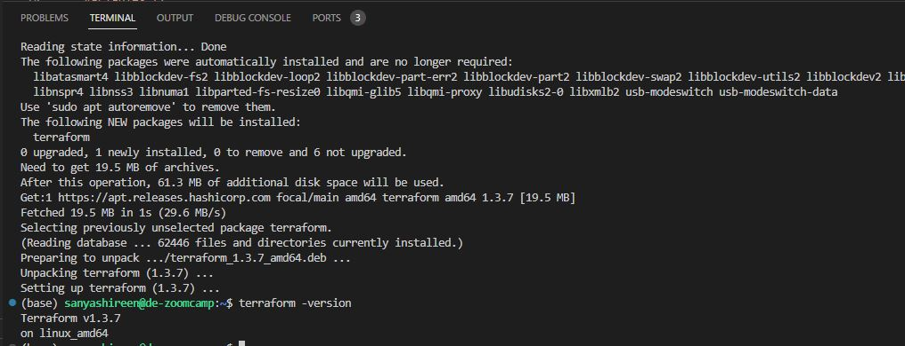

# TERRAFORM-GCP HW

### Code to download Terraform on the VM
* `wget -O- https://apt.releases.hashicorp.com/gpg | gpg --dearmor | sudo tee /usr/share/keyrings/hashicorp-archive-keyring.gpg`
* `echo "deb [signed-by=/usr/share/keyrings/hashicorp-archive-keyring.gpg] https://apt.releases.hashicorp.com $(lsb_release -cs) main" | sudo tee /etc/apt/sources.list.d/hashicorp.list`
* `sudo apt update && sudo apt install terraform`

### Check if terraform is intalled
* `terraform -version`
*  

### Check the gcloud version on VM
* `gcloud -v`

### Set the environment variable to point to the downloaded GCP auth-keys
* `export GOOGLE_APPLICATION_CREDENTIALS="/home/sanyashireen/data-engineering-zoomcamp/week_1_basics_n_setup/1_terraform_gcp/terraform/google_credentials.json"`
### Refresh token/session, and verify authentication
* `gcloud auth application-default login` - can skip this step as it is a google VM therefore authentication not required

### Update files in terraform folder
* Update the terraform version in the `.terraform-version` file
* Update the region variable in the `variables.tf` file

### Output of `terraform apply` 

```
(base) sanyashireen@de-zoomcamp:~/data-engineering-zoomcamp/week_1_basics_n_setup/1_terraform_gcp/terraform$ terraform apply
var.project
  Your GCP Project ID

  Enter a value: skilf-bliss-******


Terraform used the selected providers to generate the following execution plan. Resource actions are indicated with the following symbols:
  + create

Terraform will perform the following actions:

  # google_bigquery_dataset.dataset will be created
  + resource "google_bigquery_dataset" "dataset" {
      + creation_time              = (known after apply)
      + dataset_id                 = "trips_data_all"
      + delete_contents_on_destroy = false
      + etag                       = (known after apply)
      + id                         = (known after apply)
      + labels                     = (known after apply)
      + last_modified_time         = (known after apply)
      + location                   = "us-central1"
      + project                    = "skil----bliss-******"
      + self_link                  = (known after apply)

      + access {
          + domain         = (known after apply)
          + group_by_email = (known after apply)
          + role           = (known after apply)
          + special_group  = (known after apply)
          + user_by_email  = (known after apply)

          + dataset {
              + target_types = (known after apply)

              + dataset {
                  + dataset_id = (known after apply)
                  + project_id = (known after apply)
                }
            }

          + routine {
              + dataset_id = (known after apply)
              + project_id = (known after apply)
              + routine_id = (known after apply)
            }

          + view {
              + dataset_id = (known after apply)
              + project_id = (known after apply)
              + table_id   = (known after apply)
            }
        }
    }

  # google_storage_bucket.data-lake-bucket will be created
  + resource "google_storage_bucket" "data-lake-bucket" {
      + force_destroy               = true
      + id                          = (known after apply)
      + location                    = "US-CENTRAL1"
      + name                        = "dtc_data_lake_skil----bliss-******"
      + project                     = (known after apply)
      + public_access_prevention    = (known after apply)
      + self_link                   = (known after apply)
      + storage_class               = "STANDARD"
      + uniform_bucket_level_access = true
      + url                         = (known after apply)

      + lifecycle_rule {
          + action {
              + type = "Delete"
            }

          + condition {
              + age                   = 30
              + matches_prefix        = []
              + matches_storage_class = []
              + matches_suffix        = []
              + with_state            = (known after apply)
            }
        }

      + versioning {
          + enabled = true
        }

      + website {
          + main_page_suffix = (known after apply)
          + not_found_page   = (known after apply)
        }
    }

Plan: 2 to add, 0 to change, 0 to destroy.

Do you want to perform these actions?
  Terraform will perform the actions described above.
  Only 'yes' will be accepted to approve.

  Enter a value: yes

google_bigquery_dataset.dataset: Creating...
google_storage_bucket.data-lake-bucket: Creating...
google_storage_bucket.data-lake-bucket: Creation complete after 1s [id=dtc_data_lake_skil----bliss-******]
google_bigquery_dataset.dataset: Creation complete after 1s [id=projects/skil----bliss-******/datasets/trips_data_all]
```
