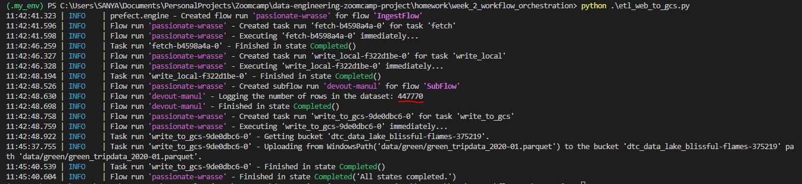
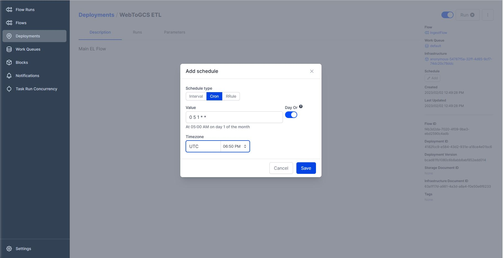
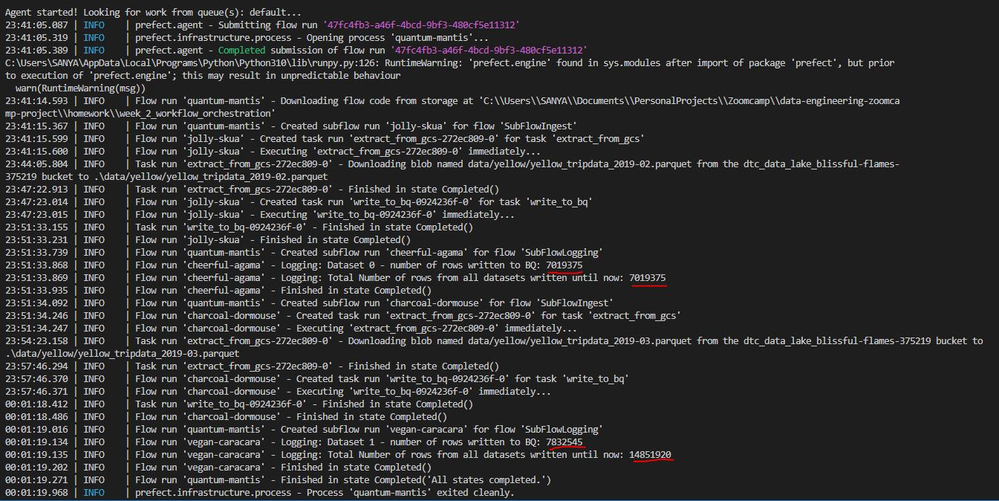
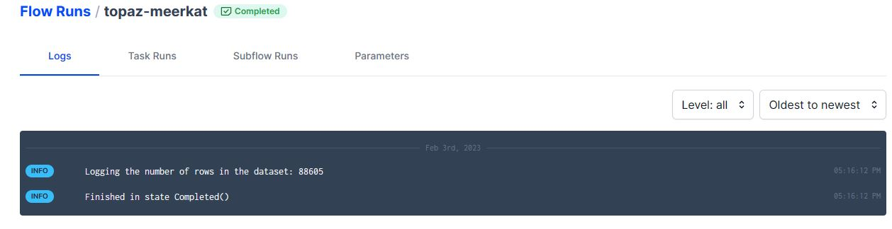
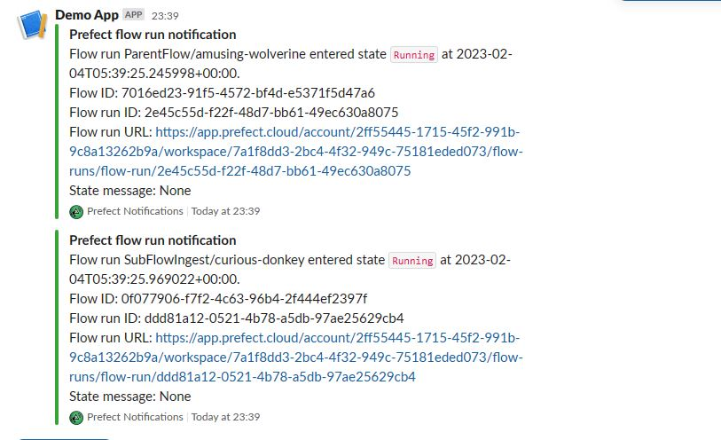

## Question 1. Load January 2020 data
How many rows does that dataset have?
* Answer : 447,770
* Screenshot of the run:
 

## Question 2. Scheduling with Cron
What’s the cron schedule?
* Answer: `0 5 1 * *`
* Solution in file: [etl_web_to_gcs.py](etl_web_to_gcs.py)
    * Option 1: CLI. Use this command to build, schedule and apply the deployment `prefect deployment build etl_web_to_gcs.py:etl_parent_flow -n "WebToGCS ETL" --cron "0 5 1 * *" --timezone "UTC" -a`
    * Option 2: After bulding and applyting the deployment, set the scheduling via the Orion UI as follows
     

## Question 3. Loading data to BigQuery 
How many rows did your flow code process?
* Answer: 14,851,920
* Solution in file: [el_gcs_to_bq.py](el_gcs_to_bq.py)
    *  

## Question 4. Github Storage Block
How many rows were processed by the script?
* Answer: 88,605
* Solution in file: [github_deploy.py](github_deploy.py)
    * 

## Question 5. Email or Slack notifications
How many rows were processed by the script?
* Answer:`514,392`
    * 
    * 
