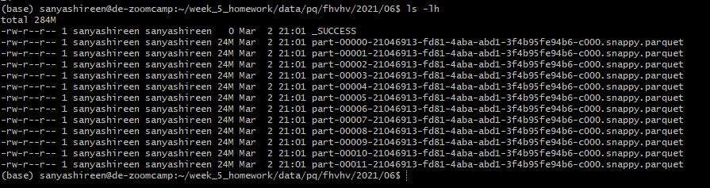
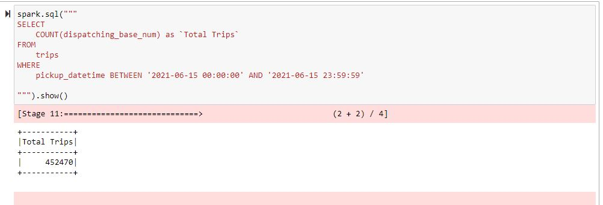
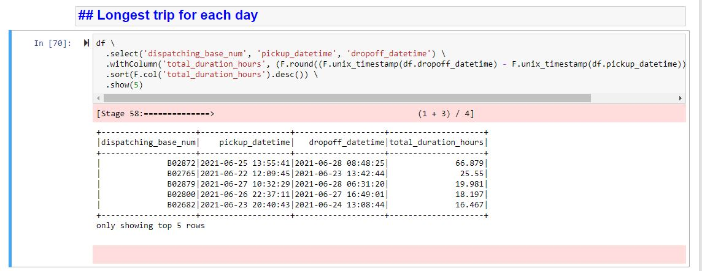
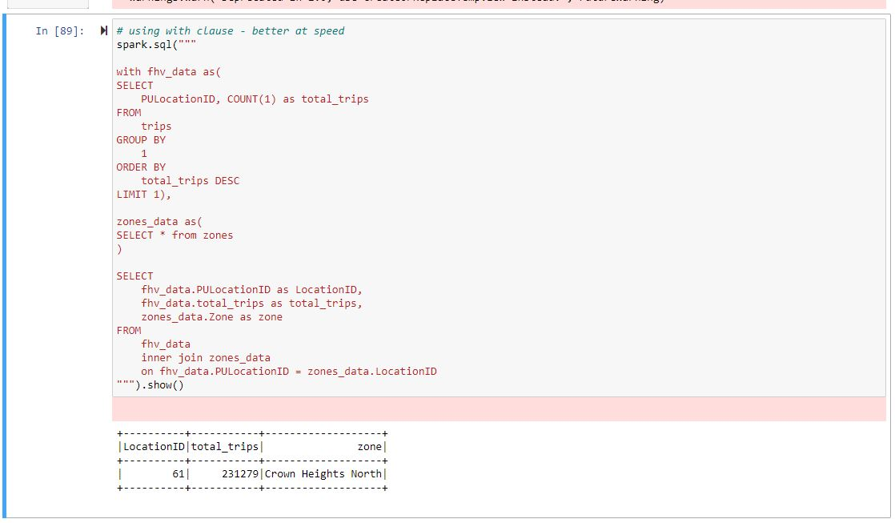

## Week 5 Homework 
NOTE:
Codes are in these files in the repo
1. [1_rw_partitions_local.ipyb](code/1_rw_partitions_local.ipynb) - has code used for solving Q1, Q2
2. [2_rt_gcs.ipyb](code/2_rt_gcs.ipynb) - has code used for solving Q3, Q4, Q6 

In this homework we'll put what we learned about Spark in practice.

For this homework we will be using the FHVHV 2021-06 data found here. [FHVHV Data](https://github.com/DataTalksClub/nyc-tlc-data/releases/download/fhvhv/fhvhv_tripdata_2021-06.csv.gz )


### Question 1: 

**Install Spark and PySpark** 

- Install Spark
- Run PySpark
- Create a local spark session:
    Start the local spark session by executing the following commands from the directory where spark is installed
    
    ```bash
    # Add PySpark to the PYHTONPATH
    export PYTHONPATH="${SPARK_HOME}/python/:$PYTHONPATH"
    export PYTHONPATH="${SPARK_HOME}/python/lib/py4j-0.10.9.5-src.zip:$PYTHONPATH"
    
    # Goto spark home directory
    cd $(echo $SPARK_HOME | tr -d '\r')
    
    # Start a standalone MASTER SERVER by executing 
    ./sbin/start-master.sh
    # Start one WORKERS and connect them to the master via
    ./sbin/start-worker.sh spark://de-zoomcamp.us-central1-c.c.blissful-flames-375219.internal:7077
    ```

- Execute spark.version.
    ```bash
    spark-shell
    spark.version
    ```
- **Answer: 3.3.2**

</br></br>


### Question 2: 

**HVFHW June 2021**
* Make a new directory week_5_homework with subfolders `code` and `data`
* We will read the raw data from the web and write the partitions in parquet to local system and then load to GCS bucket `pq/fhvhv/year_number/month_number/`
* To test locally we will use the data in the folder
Read it with Spark using the same schema as we did in the lessons.</br> 
We will use this dataset for all the remaining questions.</br>
Repartition it to 12 partitions and save it to parquet.</br>
What is the average size of the Parquet (ending with .parquet extension) Files that were created (in MB)? Select the answer which most closely matches.</br>
- **Answer: 24MB**
- 
</br></br>


### Question 3: 

**Count records**  

How many taxi trips were there on June 15?</br></br>
Consider only trips that started on June 15.</br>
- **Answer: 452,470**
- 
</br></br>


### Question 4: 

**Longest trip for each day**  

Now calculate the duration for each trip.</br>
How long was the longest trip in Hours?</br>
- **Answer: 66.87 Hours**
- 

</br></br>

### Question 5: 

**User Interface**

 Spark’s User Interface which shows application's dashboard runs on which local port?</br>
- **Answer: 4040**

</br></br>


### Question 6: 

**Most frequent pickup location zone**

Load the zone lookup data into a temp view in Spark</br>
[Zone Data](https://github.com/DataTalksClub/nyc-tlc-data/releases/download/misc/taxi_zone_lookup.csv)</br>

Using the zone lookup data and the fhvhv June 2021 data, what is the name of the most frequent pickup location zone?</br>
- **Answer: Crown Heights North**
- 
</br></br>
