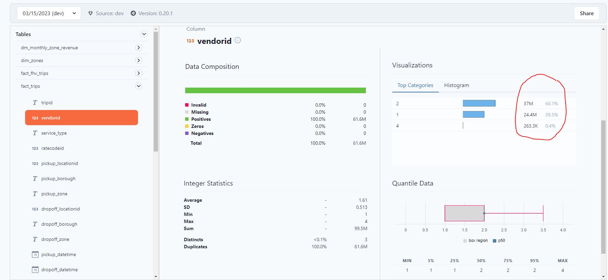
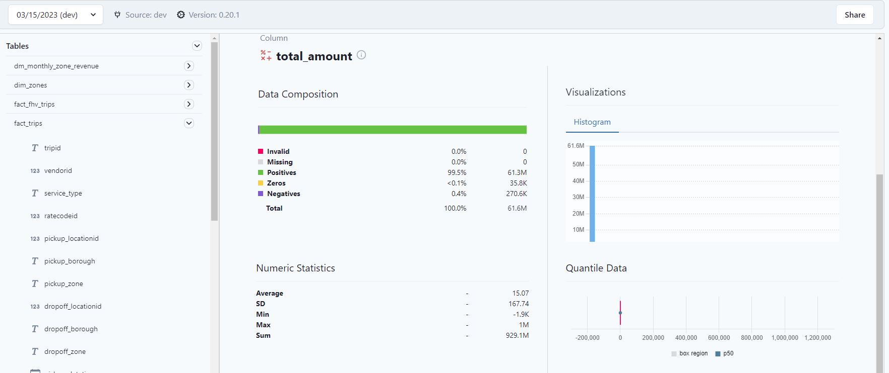
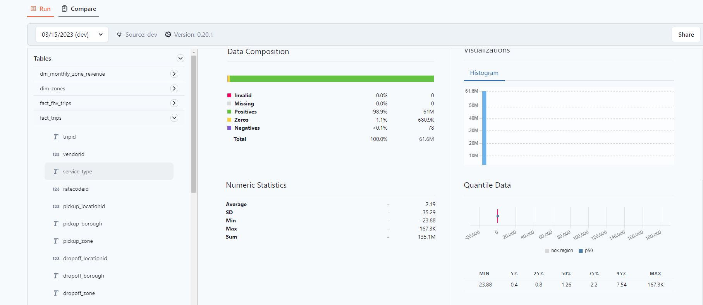

## Homework

- [Repository branch](https://github.com/sanyassyed/ny_taxi_rides_zoomcamp/tree/develop_piperider) where 
    * Did week 4 tasks with dbt-core & bigquery
    * Used Piperider

### Question 1:

What is the distribution between vendor id filtering by years 2019 and 2020 data?

You will need to run PipeRider and check the report

* Answer: 60.1/39.5/0.4
* 

### Question 2:

What is the composition if total amount (positive/zero/negative) filtering by years 2019 and 2020 data?

You will need to run PipeRider and check the report

* Answer: 61.4M/25K/148.6K
* 

### Question 3:

What is the numeric statistics (average/standard deviation/min/max/sum) of trip distances filtering by years 2019 and 2020 data?

You will need to run PipeRider and check the report

* Answer: 2.95/35.43/-23.88/167.3K/181.5M
* 
