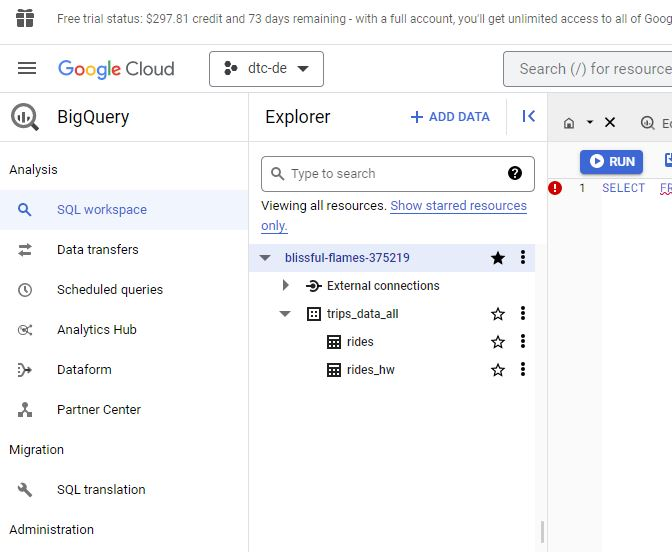

# Week 3: Data Warehouse Notes
 [All video slides are here](https://docs.google.com/presentation/d/1a3ZoBAXFk8-EhUsd7rAZd-5p_HpltkzSeujjRGB2TAI/edit#slide=id.p)

## What is BigQuery?
BigQuery is Google's fully managed, serverless ***data warehouse*** that enables scalable analysis over petabytes of data. It is a Platform as a Service that supports querying using ANSI SQL.

## Video 3.1.1 [Data Warehouse and BigQuery](https://www.youtube.com/watch?v=jrHljAoD6nM&list=PL3MmuxUbc_hJed7dXYoJw8DoCuVHhGEQb&index=25)
* All SQL queries used in this video are stored in `big_query.sql` file [also available at `bigquery_video1` in the `Project Queries` in the Big Query Platform]
* Big query structure:
    * blissful-flames-375219 -> project name
    * trips_data_all -> dataset name
    * rides & rides_hw -> table names
    
    
* Turn off `Use Cache results` for this video so we have consistent results (from `More` setting near `RUN` buttton in `Query Editor`)
* Access an open source public dataset provided by BigQuery by typing 'citibike_stations` in the search bar in the explorer.
* You will now see the `bigquery-public-data` project with the `new_york_citibike` dataset with a `citibike_stations` table.
* Create an external table using yellow taxi data from 2019 and 2020
* Use the `loading_data_via_prefect/etl_web_to_gcs.py` and `loading_data_via_prefect/etl_web_to_gcs_deploy.py` to load this data in `.csv.gz` format from the web to GCS
* Partitioning in BigQuery explained
* Clustering in BigQuery explained
* Create the following table to understand the above two concepts:
    - `yellow_tripdata_non_partitioned`
    - `yellow_tripdata_partitioned`
    - `yellow_tripdata_partitioned_clustered`
* Compared the computation size by looking at the size of data scanned for executing the same SQL query on the above tables. Partitioned and Clustered tables were found to be more effient in comparison to the non partitioned and non clustered tables.
* It's important to consider the computation as on Biq Query you would be billed accordingly

## Video 3.1.2 [Partioning and Clustering](https://www.youtube.com/watch?v=-CqXf7vhhDs&list=PL3MmuxUbc_hJed7dXYoJw8DoCuVHhGEQb&index=26)
* Partitioning vs Clustering
    * Partitioning: 
        - A partitioned table is divided into segments, called partitions, that make it easier to manage and query your data. By dividing a large table into smaller partitions, you can improve query performance and control costs by reducing the number of bytes read by a query. You partition tables by specifying a partition column which is used to segment the table.
        - Choose column that has values in a range for this
    * Clustering: 
        - Clustered tables in BigQuery are tables that have a user-defined column sort order using clustered columns. Clustered tables can improve query performance and reduce query costs. In BigQuery, a clustered column is a user-defined table property that sorts storage blocks based on the values in the clustered columns. The storage blocks are adaptively sized based on the size of the table.
        - Choose columns that have fewer distinct values (Like the ones you would select during the filtering option)
* Additional References:
    - [For Partitioning](https://cloud.google.com/bigquery/docs/partitioned-tables)
    - [For Clustering](https://cloud.google.com/bigquery/docs/clustered-tables)

## Video 3.2.1 [BigQuery Best Practices](https://www.youtube.com/watch?v=k81mLJVX08w&list=PL3MmuxUbc_hJed7dXYoJw8DoCuVHhGEQb&index=27)
* CTE - [Common Table Expression](https://towardsdatascience.com/common-table-expressions-5-tips-for-data-scientists-to-write-better-sql-bf3547dcde3e)
* For more info refer to video slides (link on top)

## Video 3.2.2 [Internals of Big Query](https://www.youtube.com/watch?v=eduHi1inM4s&list=PL3MmuxUbc_hJed7dXYoJw8DoCuVHhGEQb&index=28)
* In Big Query
    - Compute  and storage (on `Colossus` Hardware - column style data storage) are on different hardware
    - Therefore costs are lesser
    - If you want to increase the capacity of DS, you just have to buy more storage
    - The two hardwares communicate via Jupiter Network which has a 1TB of N/W speed
    - `Dremel` is the query execution engine (used by compute part of BigQuery) which divides the query into a tree structure such that each node computes a different part of the query

## Video 3.3.1 [BigQuery Machine Learning](https://www.youtube.com/watch?v=B-WtpB0PuG4&list=PL3MmuxUbc_hJed7dXYoJw8DoCuVHhGEQb&index=29)
* Build a model -> Export -> Run via Docker Image
