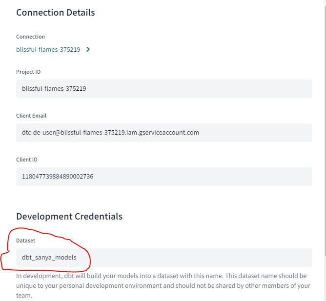

# Week 4: Analytics Engineering Notes
* `dbt` -> data build tool (Helps with the transformation of data)
*  `Defining a  Deployment Workflow`-> Develop -> Test and Document -> Deployment (Version control and CI/CD)
* dbt Core & dbt Cloud
* Two paths:
    * Big Query which has the dbt core and can connect to dbt Cloud
    * Postgres which will have the dbt core but it cannot connect to dbt cloud so instead you use local IDE and run the dbt models via CLI

## Step 1 : Start dbt project on dbt Cloud
### DBT Cloud Settings
* Note:dbt Cloud will always connect to your warehouse from `52.45.144.63`, `54.81.134.249`, or `52.22.161.231`. Make sure to allow inbound traffic from these IPs in your firewall, and include it in any database grants. 

* Sub-Directory: to build the dbt project in a particular directory, specify the directory in the sub directory. For example here I specified the sub-directory as `/week4/ny_taxi_rides_zoomcamp/` and when dbt initialized the project all the initialization happened in this directory. [Ref](https://www.youtube.com/watch?v=6zDTbM6OUcs)

* Dataset: Specify the dataset name that you created in Big Query here (e.g. `dbt_sanya_models`), otherwise dbt will automatically try to create this for you with the region specified in the 'Location' section. But you want all your datasets in BQ to be in the same region, hence it's best to create it and specify it here.


* Then push to a new branch and work on this part of the project on this branch

## Step 2 - Create 2 models `stg_green_tripdata`, `stg_yellow_tripdata` in the staging folder (Initialize and create a basic view for green taxi data:)
* Initialize the project in the folder `ny_taxi_rides_zoomcamp`; this will create new folders and files
1. Basic model for creating view using `FROM`
    * Modify `dbt_project.yml` by changing the `name` and `models` property 
    * Define the source and create the first model. Create `models/staging/schema.yml` and specify the `source` as `staging`, `project name` as `BQ project name`, `dataset name` as `trips_data_all` and t`able names` as `green_tripdata` & `yellow_tripdata ` and save
    * Create a new file `models/staging/stg_green_tripdata.sql` and write code to create `view` by selecting certain columns from green table and changing their data types.
    * Test Run 1: Run the model by using the command `dbt run --select stg_green_tripdata`
    * Check 1: Go to BQ and check if the view has been created under the `dbt_sanya_models` dataset.
2. Add a `Macro` that returns a description of the payment_type based on the number
    * Create a file `macros/get_payment_type_description.sql` and define the macro of the same name
    * Modify the `models/staging/stg_green_tripdata.sql` to add this macro to the code
    * Test Run 2: Run the model by using the command `dbt run --select stg_green_tripdata`
    * Check 1: Go to BQ and check if the view has been created under the `dbt_sanya_models` dataset withe new column `payment_type_description`
    * To check how the macro is replaced in the sql code go to the target folder and check the same file `stg_green_tripdata.sql` in the compiled folder
3. Add functions from `package` 
    * Create a new file called `packages.yml` in the project folder `ny_taxi_rides_zoomcamp`
    * Write the code to write the name of the package to be imported
    * Import the package by using the command `dbt deps` and this will download all the dependencies required for this project
    * The package will then be downloaded in the `dbt_packages` folder
    * Then add the code to the `stg_green_tripdata.sql` to call a funtion from the package via jinja function which is using double `{{}}`
    * Test Run 3: Then run the model again using the command `dbt run --select stg_green_tripdata`
    * Check the compile code 
4. Add variables
    * Two ways to define variables:
        1. In the project.yml file
        2. @ Runtime in the terminal (CLI) you pass the value via the `dbt` command using `--var`
    * Define a runtime variable `is_test_run` in the model code in the file `stg_green_tripdata.sql` to set the LIMIT
    * Use `dbt run --select stg_green_tripdata` to run with the default value for the variable
    * Or use `dbt run --select stg_green_tripdata --var 'is_test_run: false` to pass the value via CLI during runtime
5. Create a model for yellow tripdata
 * Copy the sql code same as stg_green_tripdata.sql but change the values for certain columns and the table name in the from source.
6. Run both the models using the `dbt run --var 'is_test_run: false'` command

## Creating 3rd Model called `dim_zones` in the core folder
### Creating a seed
* Mainly used for data that might not change very often
* Get the `taxi_zone_lookup.csv` file in the `seed` folder either 
    1. by copy pasting the code in a new file or 
    2. by pushing the file to the repo in the dbt branch and then pulling it.
* run the command `dbt seed` and a table will be created in the BigQuery with the column name specified in the file and will automatically assign the data types to these columns. But you can chage the data type assinment for these columns by modifying the `dbt_project.yml` file.
* if you  make any changes to rows im the .csv file in the seed folder, it will be appended when run again, to drop the previous table and recreate it without appencing rows; use the command `dbt seed --full-refresh`

### Creating the model
1. Create a new sql file in the `core` folder as `dim_zones.sql`
    * In the file
        1. Define config as table
        2. Select everything from the `taxi_zone_lookup`; (modify the service zone) using `ref` jinja function with the seed name to refer to the seed

## Creatin 4th model fact_trips.sql and building it
* This model unions the data from `stg_green_tripdata` model & `stg_yellow_tripdata` model and joins it to the data from `dim_zones` model to extract the zone data.

* Run all of these using    
    1. `dbt run` : to run all models except seed
    2. `dbt build`: to run the models and seed
    3. `dtb build --select +fact_trips` : this will run all the models and seeds `fact_trips` needs as dbt knows all the dependencies
## Testing and documenting
* Tests are defined in the .yml file eg: `staging/schema.yml`, `dbt_project.yml` (variables are defined here) 
* Types 
    1. unique
    2. not_null
    3. accepted_values
    4. A foreign key to another table
    5. Custom tests as queries
    6. relationships

* .yml file structure:
``` models:
        - name:
          description: >
          columns:
            - name:
              description:
              tests:
                - unique:
                    severity:
                - not_null:
                    severity:
                - accepted_values:
                    values:
                    severity:
                - relationships:
                    to:
                    field:
                    severity: 
            
```
## NOTE:
* Use `dbt run` runs the model does not run seed
* Use `dbt build` = runs 'seed', 'tests' and 'models'

## Errors:
* Production / Deployment error: Make sure you have merged the development with the main branch by giving a pull request. This because the production dbt pulls data directly from the main branch on git

* When using a sub folder During Production / Deployment the job was failing; this was because I had not specified the custom branch I had created a new branch called 'week4_dbt' rather than main
Soln: Specify the custom branch in both the Development and Production Environment setup 

* `Bad int64 value: 0.0` error: Some ehail fees are null and casting them to integer gives Bad int64 value: 0.0 error, hence using safe_cast returns NULL instead of throwing an error. Hence use safe_cast from dbt_utils function in the jinja code for casting.
Run this command in SQL to test and understanf this `SELECT cast('' as INTEGER)`
    
* `'is_test_run: false'` : remeber to give it in single codes and space between colon and false

* Looker Error: BigQuery error: Failed to parse input string "256" 
Soln: Build your green and yellow tables in trips_data_all dataset using partitions by tpep_pickup_datetime/lpep_pickup_datetime

* De-duplication using `over partition by` clause