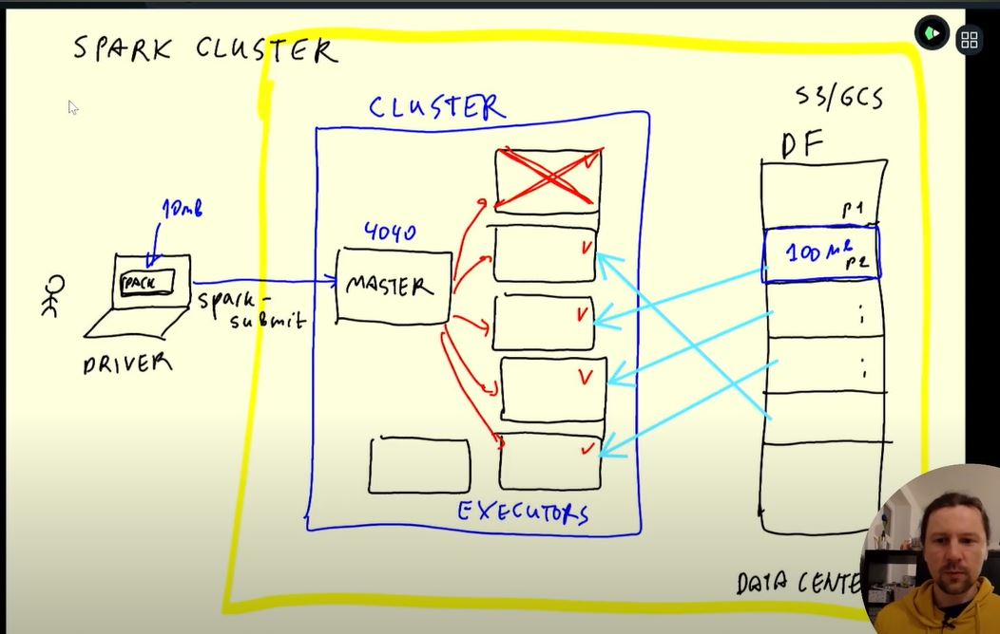

# Week 5: Batch Processing Notes

## Introduction
* What is Apache Spark
    - It is a Data Processing Engine
    - It is a multi-language engine and hence can use Java, Scala, Python (using a wrapper PySpark), R etc
    - Spark was written in Scala, that would be the native way of communicating with Spark

## Installation
* [Installing Spark on Linux](https://www.youtube.com/watch?v=hqUbB9c8sKg&list=PL3MmuxUbc_hJed7dXYoJw8DoCuVHhGEQb&index=43)
    1. Install JAVA
        1. Install Java from [open jdk version 11.0.1](https://jdk.java.net/archive/)
        2. Download the file in a new folder called `spark` using
        `wget <link_to_download>`
        3. Unzip the file using the command
        `tar xvzf <name_of_the_file_downloaded>`
        4. Check if you jave the `jdk-11.0.1` folder unzipped
        5. Delete the downloaded file using
        `rm <name_of_the_file_downloaded>`
        6. Set the path to the jdk using the following two commands to create set the variable `JAVA_HOME`
            * `export JAVA_HOME="${HOME}/spark/jdk-11.0.1"`
            * `export PATH="${JAVA_HOME}/bin:${PATH}"`
        7. Perform the path checks using the following commands
        `which java`
        `java --version`
        
            - 
    
    2. Install Spark
        1. Install Spark from [Apache Spark version 3.2.3: Pre-built for Apache Hadoop 3.3 and later (Scala 2.13)](https://dlcdn.apache.org/spark/spark-3.2.3/spark-3.2.3-bin-hadoop3.2.tgz)
        2. Download the file in a new folder called `spark` using
        `wget <link_to_download>`
        3. Unzip the file using the command
        `tar xvzf <name_of_the_file_downloaded>`
        4. Delete the downloaded file using
        `rm <name_of_the_file_downloaded>`
        5. Set the path to the jdk using the following two commands to create set the variable `JAVA_HOME`
            * `export SPARK_HOME="${HOME}/spark/spark-3.3.2-bin-hadoop3"`
            * `export PATH="${SPARK_HOME}/bin:${PATH}"`
        6. Check if spark is installed by typing `spark shell` and executing spark
        7. Test by typing following code:
        ```scala
        val data = 1 to 10000
        val distData = sc.parallelize(data)
        distData.filter(_ < 10).collect()
        ```

    3. Now add the export paths for JAVA_HOME and SPARK_HOME permenantly to the bash scricpt as follows:
        - `nano .bashrc` -> type this to open the bashrc file in the editor
        - Go to the end and append the above two export commands under the other export commands in new lines
        - `Ctrl+O` -> to save the file
        - `Ctrl+X` -> to exit the file
* Goto the localhost forwarded port 4040 to view the spark jobs being executed by spark master

## Useful Codes
* Before starting the notebook to run spark cluster execute the below commands
* To run pyspark in the VM
    ```bash
    export PYTHONPATH="${SPARK_HOME}/python/:$PYTHONPATH"
    export PYTHONPATH="${SPARK_HOME}/python/lib/py4j-0.10.9.5-src.zip:$PYTHONPATH"
    ```

## Why use Spark over DataWarehouse SQL? 
* In Spark you can write your own functions and hence it is more flexible. 
* Also many inbuilt functions are available.
* We can do tests and make sure your code works and then execute it on your dataframe
* Things that are not easy to execute in SQL can be easily done spark

## PySpark Important functions 

* `SparkSession` package imported from `pyspark.sql`
* `spark` is an object of type `pyspark.sql.session.SparkSession` (PySpark Dataframe)   
   
    -   ```python
        # to create a PySpark Dataframe object from a csv
        spark_df = spark.read\
             .option("header", "true")\
             .schema(schema)\
             .csv('fhvhv_tripdata_2021-01.csv')
        ``` 

    -  ```python
        # to create a PySpark Dataframe object from a pandas DF where Spark by default infers the schema based on the pandas data types TO PySpark data types.
        spark_df = spark.createDataFrame(pandas_df)
        ``` 
        

* Funtions to use on PySpark DF object
    - ```python
      # To view top rows of Pyspark DF in a table format
      spark_df.show()
      # To view top rows of Pyspark DF as a list
      spark_df.head()
      # To print the schema of the Pyspark DF (similar to .dtypes in pandas)
      spark_df.schema
      # To print schema in a nice tree format
      sparkDF.printSchema()
      # To get a list of columns
      sparkDF.columns
      # To rename columns
      new_sparkDF = sparkDF.withColumnRenames('old_column_name', 'new_column_name')
      # To create a new column by applying a function to an existing column Where F is functions imported from pyspark.sql package
      from pyspark.sql import functions as F
      new_sparkDF = sparkDF.withColumn('name_of_the_existing_column/new_column_name', F.function_name(sparkDF.name_of_the_existing_column) )
      # To select ceratin columns
      new_sparkDF = sparkDF.select([list_of_columns])
      # Joining multiple functions
      sparkDF = sparkDF.select(['col1_name', 'col2_name']) \
                       .withColumn('new_col_name', F.to_date(sparkDF.col1_name))
      #   
      ```


## Spark Cluster:


* Hadoop/HDFS have now become redundat because we can now just store the data directly on the cloud storage (S3 or GCS) and the Executors can access the parquet data patitions directly from there. And because the Executors and the storage are in the same data center, the transfer of data is very fast and not expensive. We no longer require the data to be replicated and stored on the Executors like it's done when using Hadoop/HDFS. 

## GroupBy in Spark

* Satge 1 - For each partition the executer creates Key-Value paris which are the Intermediate Results
* Stage 2 - Reshuffling (Expensive Operation) -> External Merge Sort Algorithm does Mapping using Key Value Pairs -> Reshuffle to bring same keys to single partition -> Reduce by merging records with same keys

## Joins
* Inner Join : Only the common records
* Outer Join : If a value for a  common column in left table is missing in rigth table then use 0 and the same for vice-versa.
* Joining Small table with a Big table - here spark uses the Broadcast methodoloy, where each executer gets a copy of the small table rather than a partition of the small table.

## RDD's
* Resilient Distributed Datasets - 

## Connecting to Google Cloud Storage

The Cloud Storage connector is an open source Java library that lets you run Apache Hadoop or Apache Spark jobs directly on data in Cloud Storage, and offers a number of benefits over choosing the Hadoop Distributed File System (HDFS).

* PUSH DATA TO GCS: 
    - Upload data from local system to GCS Bucket

```bash
    gsutil -m cp -r pq/ gs://dtc_data_lake_blissful-flames-375219/pq
```

* PULL DATA FROM GCS: 
    - Download the Hadoop connector for Spark to connect to GCS via CLI
    - First create a new directory called `lib`
    - Download the .jar file in this new folder (commands below)
    - Add the google credentials .json file to a variable
    - Follow the steps in [09_spark_gcs.ipyb](week_5_batch_processing/code/09_spark_gcs.ipyb)

```bash
    # URL of .jar file https://cloud.google.com/dataproc/docs/concepts/connectors/cloud-storage
    # Alternatively download directly from GCS using the following command to copy the .jar from GCS to gcs-connector-hadoop3-2.2.5.jar in the lib folder
    gsutil cp gs://hadoop-lib/gsc/gcs-connector-hadoop3-2.2.5.jar gcs-connector-hadoop3-2.2.5.jar
```    

## Creating local Spark cluster
* Before we created a Spark Cluster by saying the master is local.
* Create Spark cluster outside of the notebook:
(Goto this [Spark Standalone Mode](https://spark.apache.org/docs/latest/spark-standalone.html) page to find the below codes)
    
    - START A MASTER CLUSTER:
        - `./sbin/start-master.sh` use this command to start a Master cluster manually on the VM 
        - On the VM:
            * Go to the spark home directory
            ```bash
            # type this command to find the directory where spark is installed
            echo $SPARK_HOME 
            cd /home/sanyashireen/spark/spark-3.2.3-bin-hadoop3.2
            ./sbin/start-master.sh
            ```
            * This starts manually the spark MASTER cluster locally 
            * Forward the port 8080 and open the Spark Master it in the web browser
            * Open the jupyter notebook on web browser localhost:8888 after performing the following steps
                - [Step 1](#`Useful-Codes`) to set the path
                - Step 2 forward port 8888 on VSCode
                - Step 3 start the jupyter notebooks type:
                ```bash
                cd folder_with_the_code_files
                # cd /home/sanyashireen/week_5_batch_processing/code
                jupyter notebook 
                ```
    - ASSIGN AN EXECUTER TO MASTER CLUSTER
        - Go back to spark directory by executing
        ```bash
        cd /home/sanyashireen/spark/spark-3.2.3-bin-hadoop3.2
        ```
        - Then assign a worker to the master with the following command
        ```bash
        ./sbin/start-worker.sh <master-spark-URL>
        # for example 
        #./sbin/start-worker.sh spark://de-zoomcamp.us-central1-c.c.blissful-flames-375219.internal:7077
        ```

    - Run the file [10_spark_locally.ipyb](week_5_batch_processing/code/10_spark_locally.ipyb)

    - Convert the above file from a jupyter notebook to a python script
        - Go to the terminal and into the folder that has this file
        ```bash
        cd /home/sanyashireen/week_5_batch_processing/code
        # Command to convert notebook to python script
        jupyter nbconvert --to=script 10_spark_locally.ipynb
        ```  
    - STOP MASTER & WORKER CLUSTER
        - ```bash
          cd /home/sanyashireen/spark/spark-3.2.3-bin-hadoop3.2
          ./sbin/stop-master.sh
          ./sbin/stop-worker.sh
          ```  

## Creating Spark cluster in GCP [Video](https://www.youtube.com/watch?v=osAiAYahvh8&list=PL3MmuxUbc_hJed7dXYoJw8DoCuVHhGEQb&index=57)
* We use Dataproc
* Create a Dataproc instance
* Copy python code from local VM to GCS
  ```bash
  gsutil cp 10_spark_locally.py gs://dtc_data_lake_blissful-flames-375219/code/10_spark_locally.py
  ```
* Run the Spark job in this file either from UI or CLI of the VM
    * UI - Look for instructions in the video
    * CLI :
        - Step 1: Change the settings in IAM to give the VM permission to submit Spark Jobs
        - Run the command in [this](week_5_batch_processing/code/data_proc.bash) file 